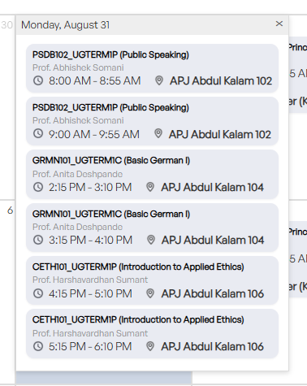

# Flame University Calendar to Google Calendar Sync

A specialized web application built for Flame University students to take a screenshot of their daily/weekly timetable from the student portal/ERP, automatically extract class details (course code, name, professor, time, classroom), and sync them directly to Google Calendar using the Google Calendar API.



## Features

- **Instant Screenshot Ingestion**:
  - Drag and drop your timetable screenshot.
  - Press <kbd>Ctrl</kbd> + <kbd>V</kbd> to paste directly from your clipboard.
  - "Try Sample" button with a preloaded Flame University timetable popup.
- **Smart Course Recognition**:
  - Automatically identifies course codes (e.g. `PSDB102_UGTERM1P`, `GRMN101_UGTERM1C`, `CETH101_UGTERM1P`), subject titles, faculty names, time slots, and classrooms (e.g. `APJ Abdul Kalam 102`).
  - Supports both **In-Browser OCR** (no API key needed) and **Gemini Vision AI** (for 100% precision on any layout).
- **Interactive Review Workspace**:
  - Side-by-side zoomable screenshot preview and editable class cards.
  - Edit or adjust course codes, times, rooms, or professor names before syncing.
  - Add extra classes manually or remove individual classes.
- **Flexible Semester Recurrence & Reminders**:
  - Target date selection (e.g., August 31, 2026).
  - Weekly semester recurrence toggle (e.g., repeat every Monday until semester end date).
  - Configurable Google Calendar notifications (10m, 15m, 30m before class).
- **Dual Sync Options**:
  - **Direct Google Calendar API (OAuth 2.0)**: Direct browser-to-Google sync via Google Identity Services.
  - **Instant 1-Click .ICS File Export**: RFC 5545 compliant `.ics` calendar file for zero-setup import into Google Calendar, Outlook, or Apple Calendar.
  - **Direct Web Links**: Open any single class in Google Calendar with one click.

---

## Quick Start

### Option 1: Run with Python (Recommended)

Run the included local development server:

```powershell
python server.py
```

Then open your browser at **[http://localhost:8000](http://localhost:8000)**.

### Option 2: Direct File Open

You can also double-click **`index.html`** in File Explorer to open the application directly in Google Chrome, Microsoft Edge, or Firefox.

---

## How to Set Up Direct Google Calendar API Sync

To sync events with 1 click directly into your Google Calendar using Google's official API:

1. Go to the [Google Cloud Console Credentials Page](https://console.cloud.google.com/apis/credentials).
2. Create a project (or select an existing one).
3. Enable the **Google Calendar API** in **APIs & Services &rarr; Enable APIs and Services**.
4. Click **Create Credentials** &rarr; **OAuth client ID**:
   - Application type: **Web application**
   - Name: `Flame Calendar Sync`
   - Under **Authorized JavaScript origins**, add:
     - `http://localhost:8000`
     - `http://127.0.0.1:8000`
5. Click **Create**, then copy your **Client ID** (ends with `.apps.googleusercontent.com`).
6. In the FlameSync web app, click **API Settings** (top right), paste your Client ID, and click **Save Settings**.
7. Click **Add to Google Calendar** — your browser will prompt you to authorize your Google account once, and events will sync automatically!

> [!NOTE]
> **No Google Cloud setup?** You can always use the **"Export .ICS"** button to download a standard calendar file and import it into Google Calendar in 5 seconds without configuring any API keys!

---

## Privacy & Security

All operations run **100% client-side** in your web browser. Your credentials, images, and timetable data are stored only in your local browser storage (`localStorage`) and communicated directly with Google's official endpoints.
